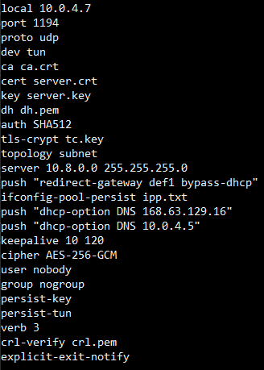

# Proyecto #2 - Creaci�n de servicio VPN, Servidor web(VHost) y servidor SQL
Debido a la pandemia de Covid-19, la empresa �Los Patitos S.A� los ha contratado a usted ysu compa�ero,
para implementar una soluci�n de VPN para habilitar a sus colaboradores la opci�n   de   teletrabajo.
Para   demostrar   su   soluci�n   deber�   considerar   al   menos   los   seisdispositivos que se muestran
en el siguiente diagrama.La empresa �Noire S.A.� requiere desplegar toda su infraestructura en la nube de Azure,
para lo cual usted deber� aprovisionar y configurar una servidor de OpenVPN, que ser� el�nico que tendr�
un puerto expuesto a Internet (el puerto 1194, en TCP/UDP), en otras dossub-redes de Azure, 
usted deber� desplegar una servidor web con Apache2 y un servidor deMySQL.

Los trabajadores podr�n acceder a dichos recursos desde clientes en Windows, GNU/Linux y Android,
el nivel de acceso depender� del rol del trabajador.

El personal de tecnolog�as podr�acceder tanto al servidor web, como al servidor de base de datos,
mientras que el resto elpersonal solo podr� acceder al servidor de Apache2, para consumir los sitios
que est�npublicados en dicho servido

# Contenido:

1. [Configuración de Autoridad certificadora, del servidor y primer cliente](#item1)
2. [Configuración de OpenVPN](#item2)
3. [Programación de script para creación de usuarios nuevos](#item3)
4. [Configuración de servicios de Firewall](#item4)
5. [Configuración de Vhost Apache 2 y servicio DNS](#item5)
6. [Configuración de Base de Datos en MySQL](#item6)

<a name="item1"></a>
# Configuración de Autoridad certificadora, del servidor y primer cliente

## Parte #1: Instalación de paquetes y servicios.
Todas las siguientes librerias son necesarias para la utilizar satisfactoriamente el servicio de VPN
```bash
apt-get install openvpn openssl ca-certificates iptables

mkdir -p /etc/openvpn/server/easy-rsa/
wget  https://github.com/OpenVPN/easy-rsa/releases/download/v3.0.8/EasyRSA-3.0.8.tgz
chown -R root:root /etc/openvpn/server/easy-rsa/
tar xz EasyRSA-3.0.8.tgz /etc/openvpn/server/easy-rsa/
```

## Parte #2: Iniciar entorno de EasyRSA PKI y configuración de CA (Autoridad certificadora)
Primero nos drigimos a la carpeta del servidor e ingresamos los siguientes comandos
```bash
cd /etc/openvpn/server/easy-rsa/
./easyrsa init-pki
```

## Parte #3: Creación de Deffie Hellman
En este punto crearemos la clave o módulos Diffie-Hellman utilizados por OpenVPN al establecer el primer contacto entre los nodos de la VPN.
```bash
./easyrsa gen-dh
```
## Parte 4: Generación de la llave y el certificado de la Autoridad Certificadora
el .crt Es la clave pública de la autoridad certificante encapsulada en un formato de certificado digital x509 que tanto cliente como servidor 
OpenVPN utilizarán para identificarse entre si con confianza mutua

la .key es la clave privada RSA de la autoridad certificante, y es con la que se firman las claves y certificados tanto del servidor como de los clientes.
```bash
./easyrsa --batch build-ca nopass
```
## Parte 5: Copiar la llave y el certificado de la CA 
Esto es necesario para facilitar la configuración del servidor OpenVPN
```bash
cp pki/ca.crt /etc/openvpn/server
cp pki/private/ca.key /etc/openvpn/server
```

## Parte #6 Creación de certificado y llave del servidor: 
Luego de crear la CA crearemos el certificado y la llave para el servidor
```bash
./easyrsa build-server-full server nopass
cp pki/issued/server.crt /etc/openvpn/server
cp pki/private/server.key /etc/openvpn/server
```

## Parte 7: Creación de certificado y llave para el cliente
Con el siguiente comando crearemos la key y el crt del cliente.
```bash
./easyrsa build-client-full "$client" nopass
```

## Parte 8: Generar CRL
El siguiente comando será para crear una lista de certificados revocados
```bash
./easyrsa gen-crl
```

## Parte 9: Administrar los permisos de la CRL
El siguiente permiso es para que el documento no tenga dueño ni grupo y cualquiera la pueda acedder
```bash
chown nobody:nogroup /etc/openvpn/server/crl.pem
```

## Parte 10: Generar una llave para TLS-Crypt
Esto nos servirá para agregar soporte para usar la autentificación TLS y de este modo fortificar la 
seguridad del servidor VPN.
```bash
openvpn --genkey --secret /etc/openvpn/server/tc.key
```

<a name="item2"></a>
# Configuración de OpenVPN
Se configura el archivo server.conf de openvpn, lo mejor utilizar los archivos de configuración de muestra 
de OpenVPN como punto de partida para su propia configuración.



<a name="item3"></a>
# Programación de script para creación de usuarios nuevos
El siguiente script fue realizado con el fin de ejecutar comandos por medio de una bash scripting y 
lograr crear nuevos usuarios para el sistema, todo esto con el fin de facilitar las labores administrativas

Script:
```bash
	new_client () {
	{
	cat /etc/openvpn/server/client-common.txt
	echo "<ca>"
	cat /etc/openvpn/server/easy-rsa/pki/ca.crt
	echo "</ca>"
	echo "<cert>"
	sed -ne '/BEGIN CERTIFICATE/,$ p' /etc/openvpn/server/easy-rsa/pki/issued/"$client".crt
	echo "</cert>"
	echo "<key>"
	cat /etc/openvpn/server/easy-rsa/pki/private/"$client".key
	echo "</key>"
	echo "<tls-crypt>"
	sed -ne '/BEGIN OpenVPN Static key/,$ p' /etc/openvpn/server/tc.key
	echo "</tls-crypt>"
	} > ~/"$client".ovpn
}
	echo
	echo "Provide a name for the client:"
	read -p "Name: " unsanitized_client
	client=$(sed 's/[^0123456789abcdefghijklmnopqrstuvwxyzABCDEFGHIJKLMNOPQRSTUVWXYZ_-]/_/g' <<< "$unsanitized_client")
	while [[ -z "$client" || -e /etc/openvpn/server/easy-rsa/pki/issued/"$client".crt ]]; do
	echo "$client: invalid name."
	read -p "Name: " unsanitized_client
	client=$(sed 's/[^0123456789abcdefghijklmnopqrstuvwxyzABCDEFGHIJKLMNOPQRSTUVWXYZ_-]/_/g' <<< "$unsanitized_client")
	done
	cd /etc/openvpn/server/easy-rsa/
	EASYRSA_CERT_EXPIRE=3650 ./easyrsa build-client-full "$client" nopass
	new_client
	echo
	echo "$client added. Configuration available in:" ~/"$client.ovpn"
	exit
```
<a name="item4"></a>
# Configuración de servicios de Firewall
En este proyecto el acceso a los servidores es sumamente restringido, de forma que solo los administradores
de la red pueden ingresar a los mismos, en este caso por medio de el firewall iptables habilitaremos la conexión
a solo 1 dispositivo para ingresar y el resto de la red de cliente será bloqueada.


<a name="item5"></a>
# Configuración de Vhost Apache 2 y servicio DNS

## Instalar los paquetes de apache2 y el Servicio de DNS
Para elaborar está sección necesitamos instalar los siguientes servicios por medio de los comando:
```bash
sudo apt-get update
sudo apt-get install apache2 bind9
```

## Crear los directorios de las 2 páginas web 
Cada una de las páginas deberá tener su propio directorio que contendra todo su codigo web
```bash
sudo mkdir -p /var/www/html/noire.isw612.xyz.co.cr
sudo mkdir -p /var/www/html/noire.isw612.xyz.com
```

## Crear la configuración de los Vhost
En este paso copiamos el archivo por defecto y creamos una copia para cada una de nuestras vhost
```bash
sudo cp /etc/apache2/sites-available/000-default.conf /etc/apache2/sites-available/noire.isw612.xyz.com.conf
sudo cp /etc/apache2/sites-available/000-default.conf /etc/apache2/sites-available/noire.isw612.xyz.co.cr.conf
```

## Configuración de los sitios
Se configura los archivos anteriormente generados para que queden de la siguiente forma


<a name="item6"></a>
# Configuración de Base de Datos en MySQL