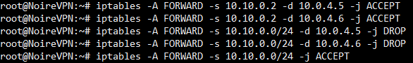

# Proyecto #2 - Creaci�n de servicio VPN, Servidor web(VHost) y servidor SQL
Debido a la pandemia de Covid-19, la empresa �Los Patitos S.A� los ha contratado a usted ysu compa�ero,
para implementar una soluci�n de VPN para habilitar a sus colaboradores la opci�n   de   teletrabajo.
Para   demostrar   su   soluci�n   deber�   considerar   al   menos   los   seisdispositivos que se muestran
en el siguiente diagrama.La empresa �Noire S.A.� requiere desplegar toda su infraestructura en la nube de Azure,
para lo cual usted deber� aprovisionar y configurar una servidor de OpenVPN, que ser� el�nico que tendr�
un puerto expuesto a Internet (el puerto 1194, en TCP/UDP), en otras dossub-redes de Azure, 
usted deber� desplegar una servidor web con Apache2 y un servidor deMySQL.

Los trabajadores podr�n acceder a dichos recursos desde clientes en Windows, GNU/Linux y Android,
el nivel de acceso depender� del rol del trabajador.

El personal de tecnolog�as podr�acceder tanto al servidor web, como al servidor de base de datos,
mientras que el resto elpersonal solo podr� acceder al servidor de Apache2, para consumir los sitios
que est�npublicados en dicho servido

# Contenido:

1. [Configuración de OpenVPN](#item1)
2. [Programación de script para creación de usuarios nuevos](#item2)
3. [Configuración de servicios de Firewall](#item3)
4. [Configuración de Vhost Apache 2 y servicio DNS](#item4)
5. [Configuración de Base de Datos en MySQL](#item5)

<a name="item1"></a>
# Configuración de OpenVPN

## Parte #1: Instalación de paquetes y servicios.
Todas las siguientes librerias son necesarias para la utilizar satisfactoriamente el servicio de VPN
```bash
apt-get install openvpn openssl ca-certificates iptables
mkdir -p /etc/openvpn/server/easy-rsa/
wget  https://github.com/OpenVPN/easy-rsa/releases/download/v3.0.8/EasyRSA-3.0.8.tgz
tar xz EasyRSA-3.0.8.tgz /etc/openvpn/server/easy-rsa/

```

## Parte #2: Creación de pki y configuración de CA (Autoridad certificadora)
Primero nos drigimos a la carpeta del servidor e ingresamos a easy-rsa
```bash
cd /etc/openvpn/server/easy-rsa/
./easyrsa init-pki
./easyrsa --batch build-ca nopass
cp pki/ca.crt /etc/openvpn/server
cp pki/private/ca.key /etc/openvpn/server
```
Con estos comandos anteriores se creará el certificado y la llave de la CA, luego lo moveremos en la 
raiz del servidor.

## Parte #3 Creación de certificado y llave del servidor: 
Luego de crear la CA crearemos el certificado y la llave para el servidor
```bash
./easyrsa build-server-full server nopass
cp pki/issued/server.crt /etc/openvpn/server
cp pki/private/server.key /etc/openvpn/server
```
<a name="item2"></a>
# Programación de script para creación de usuarios nuevos
El siguiente script fue realizado con el fin de ejecutar comandos por medio de una bash scripting y 
lograr crear nuevos usuarios para el sistema, todo esto con el fin de facilitar las labores administrativas

Script:
```bash
	echo "Provide a name for the client:"
	read -p "Name: " client
	cd /etc/openvpn/server/easy-rsa/
	EASYRSA_CERT_EXPIRE=3650 ./easyrsa build-client-full "$client" nopass
	echo "$client added. Configuration available in:" ~/"$client.ovpn"
```
<a name="item3"></a>
# Configuración de servicios de Firewall
En este proyecto el acceso a los servidores es sumamente restringido, de forma que solo los administradores
de la red pueden ingresar a los mismos, en este caso por medio de el firewall iptables habilitaremos la conexión
a solo 1 dispositivo para ingresar y el resto de la red de cliente será bloqueada.



<a name="item4"></a>
# Configuración de Vhost Apache 2 y servicio DNS

## Instalar los paquetes de apache2 y el Servicio de DNS
Para elaborar está sección necesitamos instalar los siguientes servicios por medio de los comando:
```bash
sudo apt-get update
sudo apt-get install apache2 bind9
```

## Crear los directorios de las 2 páginas web 
Cada una de las páginas deberá tener su propio directorio que contendra todo su codigo web
```bash
sudo mkdir -p /var/www/html/noire.isw612.xyz.co.cr
sudo mkdir -p /var/www/html/noire.isw612.xyz.com
```

## Crear la configuración de los Vhost
En este paso copiamos el archivo por defecto y creamos una copia para cada una de nuestras vhost
```bash
sudo cp /etc/apache2/sites-available/000-default.conf /etc/apache2/sites-available/noire.isw612.xyz.com.conf
sudo cp /etc/apache2/sites-available/000-default.conf /etc/apache2/sites-available/noire.isw612.xyz.co.cr.conf
```

## Configuración de los sitios
Se configura los archivos anteriormente generados para que queden de la siguiente forma


<a name="item5"></a>
# Configuración de Base de Datos en MySQL