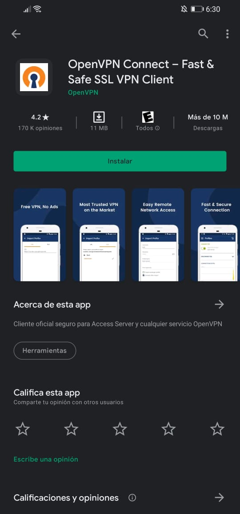
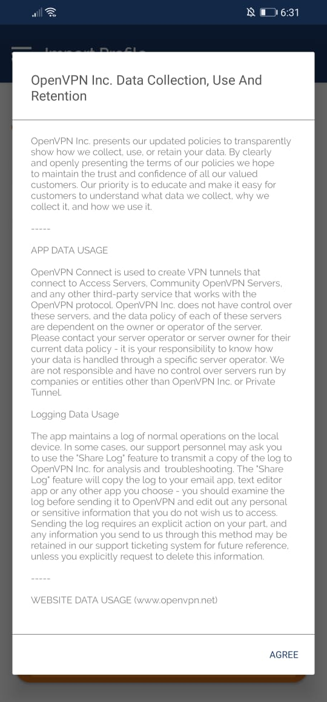
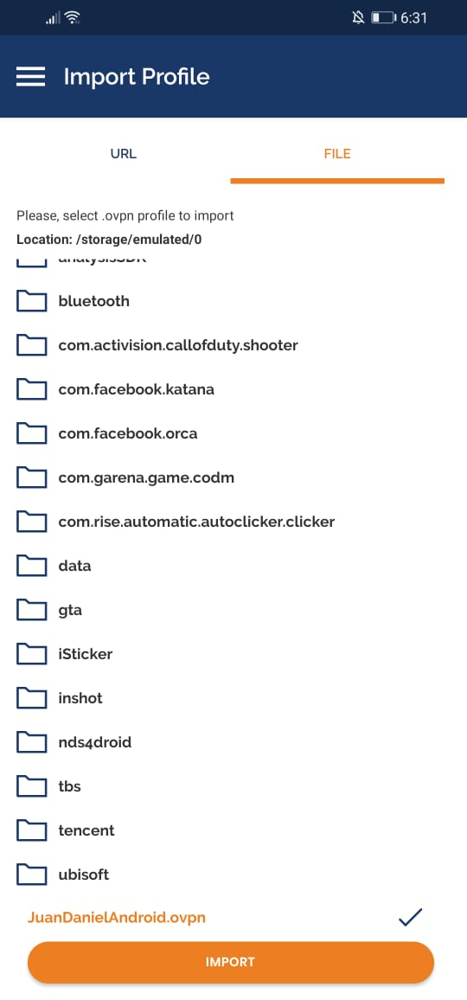

# Proyecto #2 - Manual de usuario
Este manual tiene como fin ayudar a todos aquellos usuarios finales que necesitan ingresar a la VPN de la empresa desde dispositivos con 
sistema operativo Windows, cualquier distribuci�n de linux y desde dispositivos de tipo Android.

# Contenido:
1. [Solicitud de archivo para ingresar a la VPN](#item1)
2. [Configurar VPN en dispositivo Windows](#item2)
3. [Configurar VPN en dispositivo Linux](#item3)
4. [Configurar VPN en dispositivo Android](#item4)

<a name="item1"></a>
# Solicitud de archivo para ingresar a la VPN
Para solicitar el ingreso a la VPN empresarial deber� comunicarse con el administrador de sistema o con el equipo de Tecnologias de la informac�n
para que suministre sus datos personales y el tipo de dispositivos que va a utilizar para ingresar.

<a name="item2"></a>
# Configurar VPN en dispositivo Windows
Luego de obtener el archivo por el equipo de TI o el administrador de sistemas deber� seguir los siguientes pasos.

## Paso #1: Descargue el archivo con extensi�n .ovpn
Este archivo deber� colocarlo en una carpeta segura que ningun otro usuario tenga acceso a la misma, recuerde que debe tener cuidado con 
este archivo ya que facilita la conexi�n hacia la red empresarial.

## Paso #2: Descargue la aplicaci�n de OpenVPN
A continuaci�n se suministra el link para descargar la aplicaci�n oficial para conectarse a la red, es importante que utilice este link
y no descargue otra aplicaci�n de terceros por cuestiones de seguridad.
```
https://openvpn.net/downloads/openvpn-connect-v3-windows.msi
```
Luego de descargar el archivo lo ejecuta.

Aceptar la instalaci�n del archivo


Lo anterior abrir� un wizard, presionamos el boton de next


Aceptamos terminos y condiciones


Finalmente presionamos el boton de Install


## Paso #3: Ejecutar la aplicaci�n 
Buscamos OpenVPN GUI y lo ejecutamos


## Paso #4: Importar el archivo OVPN
Se abrir� est� aplicaci�n en la barra de tareas, el icono es el de la computadora con el candado.


Le damos click derecho al icono y seleccionamos la opcion de import file...


Esto abrir� un exporador de archivos, ac� buscamos el archivo que anteriormente descargamos


Luego de cargar nuestro archivo, presionamos de nuevo con click derecho la aplicaci�n en la barra de tareas y le damos en Connect

<a name="item3"></a>
# Configurar VPN en dispositivo Linux

## Paso #1: Descargue el archivo con extensi�n .ovpn
Este archivo deber� colocarlo en una carpeta segura que ningun otro usuario tenga acceso a la misma, recuerde que debe tener cuidado con 
este archivo ya que facilita la conexi�n hacia la red empresarial.

## Paso #2: Descargue el OpenVPN desde la consola
Abrimos la terminal y ejecutamos los siguientes comandos
```bash
apt-get update
apt-get install openvpn
```

## Paso #3: Importar el archivo de configuraci�n
Ejecute el proximo comando para configurar su dispositivo para ingresar a la red empresarial
```bash
cd "Ruta del archivo (/home/usuario/documentos)"
openvpn --config "nombre del archivo"
```

## Paso #4: Comprobaci�n de conectividad
Ejecutamos el siguiente comando para saber si la conexi�n est� establecida
```bash
ping -c 4 10.0.4.7
```

<a name="item4"></a>
# Configurar VPN en dispositivo Android

## Paso #1: Descargue el archivo con extensi�n .ovpn
 ## Paso #1: Descargue el archivo con extensi�n .ovpn
Este archivo deber� colocarlo en una carpeta segura que ningun otro usuario tenga acceso a la misma, recuerde que debe tener cuidado con 
este archivo ya que facilita la conexi�n hacia la red empresarial.

## Paso #2: Descargar la aplicaci�n desde la PlayStore
Instalar la siguiente aplicaci�n de Open VPN


## Paso #3: Importar el archivo descargado
Primero aceptamos los terminos y condiciones


Segundo presionamos la casilla superior de file, buscamos el archiv OVPN y presionamos IMPORT


Luego presionamos el boton ADD en la parte superior derecha


Por ultimo nuestra configuraci�n quedar� guardada de la siguiente manera, ac� puede activar la conexi�n o desconectarse de la red 
